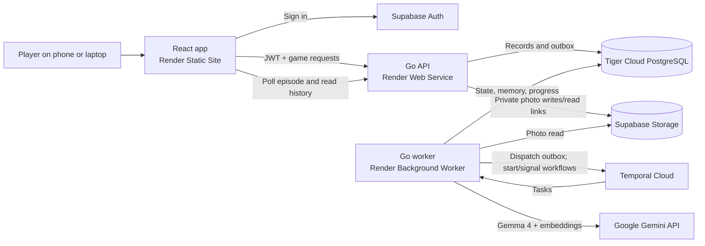
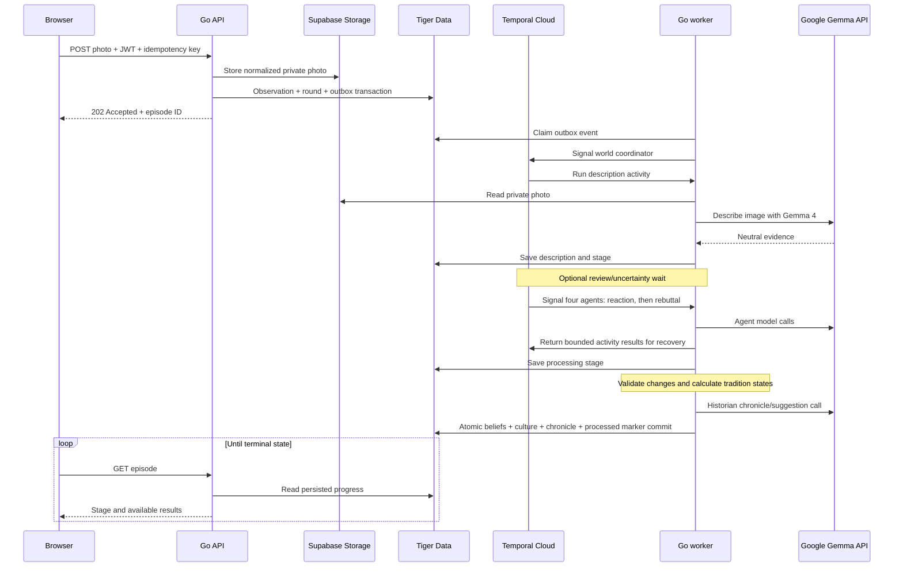

# Mythborn: Version 1 Architecture

Status: **design for implementation, not a description of deployed code.** [FUNCTIONAL_SPEC.md](./FUNCTIONAL_SPEC.md) defines what the player experiences; [TECHNOLOGIES.md](./TECHNOLOGIES.md) records the selected products, libraries, and Render budget. This document defines how the pieces communicate and where data lives.

[DATABASE_DESIGN.md](./DATABASE_DESIGN.md) defines the proposed schema and relationship diagrams. Database names are `games` for worlds/civilizations and `rounds` for episodes/councils/closing operations. Existing HTTP names can map to these records. Account-level Admin permission is separate from a game's immutable player role. Permanent game history keeps final historian records and short conversation summaries, rather than raw debates or chat transcripts.

## 1. The short answer

Yes: the **React frontend calls the Go API**, which records a durable command and returns an episode ID. The API does not hold a request open while four agents debate. A **Go Temporal worker running on Render** dispatches the command, retrieves the private photo, calls **Google's hosted Gemma API** for the visual description and agent writing, and saves results to **Tiger Data**. The frontend polls the Go API for progress. The browser also talks directly to **Supabase Auth** to sign in; it never receives the Google API key or talks directly to Temporal, Tiger Data, or the model endpoint.

Render runs the user-facing frontend, the Go API, and the code that executes agent work. Temporal Cloud stores durable workflow execution state. Google hosts **model inference**, not the Mythborn backend. Tiger Data is the canonical game database; Supabase Storage holds photo objects, while Supabase Auth owns passwords and identity-provider sessions. Supabase's internal Postgres is used for its own Auth/Storage metadata, not Mythborn game tables.

## 2. Service responsibilities and boundaries

| Component | Owns | Does not own |
| --- | --- | --- |
| React app | Screens, role previews, camera/file picker, auth session, polling and display | Game rules, ownership decisions, secrets, direct model calls |
| Go API | JWT verification, owner/role checks, upload and photo access, reads, commands, idempotency, HTTP errors | Long-running model work or agent state in process memory |
| Go Temporal worker | Coordinator and agent workflows, model/storage/database activities, outbox dispatch, retries | Public HTTP requests or the canonical game ledger |
| Temporal Cloud | Durable execution history, signals, timers, task queues | User-visible chronicles or original photos |
| Tiger Data | Accounts/permissions, templates, games, round progress, conversation summaries, beliefs/revisions, traditions/revisions, chronicles, search index, outbox | Passwords, image bytes, permanent raw debates or chat transcripts |
| Supabase Auth/Storage | Identity sessions and private photo objects | Game state and agent memory |
| Gemini API | Hosted Gemma 4 image/text inference and text embeddings | Durable Mythborn world state |

There is **one Go module** with two entrypoints, `cmd/api` and `cmd/worker`. Shared `internal/` packages define domain types, SQL access, Temporal payloads, Google and Supabase clients, and authorization rules. `web/` is the independent React/TypeScript app. The services deploy separately from the same repository. Keep domain rules such as role permissions and three-of-four voting in Go code, not prompts or frontend conditionals.

## 3. Trust and data rules

1. The browser signs in through Supabase Auth and sends its access JWT as `Authorization: Bearer ...` to the Go API. API middleware verifies the signature against a cached Supabase JWKS, allowed algorithm, issuer, audience, and expiration. It uses the verified `sub` as the application account ID. Every player-scoped query joins through `games.owner_account_id`; server-side account Admin permission grants application-wide access through administrative operations. UI hiding is never an authorization check. Memory retrieval still respects game and agent boundaries.
2. The API and worker each receive only the server credentials they need: both use Tiger Data and private Storage; only the worker needs Temporal and Google credentials. No secret or raw database connection reaches the browser. Top-level workflow start/command signals contain **IDs and small immutable facts**. Activity inputs/results and agent-result signals may contain bounded text needed for debate or reply recovery; they never contain photo bytes, model keys, or entire belief ledgers.
3. Photos are private in Supabase Storage. The API validates ownership before returning a short-lived signed read URL. Uploads pass through the API so it can validate file bytes, image dimensions, role-specific fields, and the one-active-episode rule. Restrict request body size to the 10 MB product limit plus small form overhead; cap decoded pixel count to avoid decompression attacks. Normalize image orientation, decode/re-encode, and remove EXIF before storage. Do not use GPS or EXIF for gameplay.
4. A model-visible photo is sent to Google only after an in-app explanation of external AI processing. The worker uses the Gemini Files API for the one visual-description pass and attempts to delete the temporary Google file after use; retry deletion when its file ID is known. Google documents automatic expiry after 48 hours for orphaned files, but this is **not** a promise that all provider-side processing data is erased. The Gemini API's current Gemma free tier may use submitted content to improve Google products; the UI/privacy copy must say so. [Gemma image API](https://ai.google.dev/gemma/docs/core/gemma_on_gemini_api), [Gemini Files API](https://ai.google.dev/gemini-api/docs/files), and [Gemini pricing](https://ai.google.dev/gemini-api/docs/pricing).
5. Photo descriptions, testimony, proclamations, and text found inside images are **untrusted input**. Agent prompts label their sources and forbid them from issuing system instructions. Agents have no direct database-writing tool; the Go worker validates structured output and applies deterministic rules before committing changes. Avoid raw image bytes, signed URLs, JWTs, full private prompts, raw debates, or chat transcripts in logs and tracing.

## 4. World creation and lifecycle

The API creates a `games` row with its immutable player role, settings, four agent rows, copied admin-defined starting beliefs with initial revisions, and a `start_world` outbox event in one Tiger Data transaction. It copies the active template versions from a consistent snapshot; later template edits affect future games only. The worker starts five long-lived top-level Temporal workflows with stable IDs: one coordinator (`world/{id}`) and one each for Priest, Scientist, Soldier, and Historian (`world/{id}/agent/{role}`). If dispatch retries after a crash, already-started workflow IDs count as success. A world is usable when the coordinator and agents are running; until then the UI can show **Starting**.

The coordinator serializes discovery episodes within a world, owns the daily council timer, and handles end requests. Each agent workflow waits for assigned episode or conversation signals and has its own durable execution history. Its **personality is a versioned prompt**, while its lasting beliefs are stored in Tiger Data and loaded when needed. This prevents a worker restart from erasing identity and avoids treating Temporal's history as an editable memory database. Use Continue-As-New periodically for long-lived workflows. Temporal workflow code uses deterministic SDK timers/signals/concurrency; network and SQL calls run in activities. [Temporal Go SDK](https://docs.temporal.io/develop/go).

World states are `starting`, `active`, `ending_requested`, `ending`, `archived`, and `deleting`. New observations and Messenger messages require `active`. `ending_requested` waits for in-flight state-changing work to finish or fail visibly; then the Historian writes exactly one closing chronicle. A unique `kind = closing` round is reused on retry. Its completion, final chronicle, processed outbox marker, and game archive transition share a database transaction. Archived worlds have no running councils or writable threads. Deletion is a separate, idempotent cleanup process: mark `deleting`, stop the five workflows, clear pending commands and transient reply buffers, remove photo objects, then remove game rows and derived search rows. Include retained workflow-history cleanup according to the configured retention policy; SQL deletion does not immediately erase Temporal history. External deletion and SQL deletion cannot share one transaction, so retry incomplete cleanup and keep the world hidden while it is deleting. For account deletion, persist an `account_deletion_jobs` record first, block new actions for that user, clean all worlds, remove the application account, then delete the Supabase Auth user. The job's external account UUID is independent of the application-account FK so the job survives until all cleanup succeeds.

## 5. Photo submission and episode state machine

The browser captures or selects JPEG, PNG, or WebP, then posts it to the Go API with the world ID, optional God proclamation or Messenger testimony, and an idempotency key. The API verifies ownership and role permissions, checks the image and source-byte hash, and returns the prior episode ID if an identical image already appeared in the same world. The player may resubmit with an explicit reuse flag. The API writes a normalized image to private storage, then commits the `observations`, `rounds`, and `workflow_outbox` rows. If the SQL transaction fails after object upload, it deletes the orphan object; a periodic cleanup pass catches crash leftovers. A partial unique constraint or equivalent locked transaction enforces **one open history operation per game**.

```mermaid
stateDiagram-v2
    [*] --> queued
    queued --> describing: discovery starts
    queued --> reacting: retry from accepted evidence
    queued --> debating: retry from available reactions
    queued --> writing: retry from available rebuttals
    describing --> awaiting_review: usable description; review on
    describing --> awaiting_clarity_choice: description too uncertain
    describing --> reacting: usable description; review off
    awaiting_review --> reacting: accept or correct
    awaiting_clarity_choice --> reacting: continue uncertain
    awaiting_clarity_choice --> abandoned: try another photo
    reacting --> debating: four initial reactions available
    debating --> writing: four rebuttals available; culture proposal calculated
    writing --> complete: atomic chronicle commit
    describing --> needs_attention: retries exhausted
    reacting --> needs_attention: retries exhausted
    debating --> needs_attention: retries exhausted
    writing --> needs_attention: retries exhausted
    needs_attention --> describing: retry from safe checkpoint
    needs_attention --> reacting: retry from safe checkpoint
    needs_attention --> debating: retry from safe checkpoint
    needs_attention --> writing: retry from safe checkpoint
    needs_attention --> failed: stop unsuccessful round
    failed --> queued: explicit retry using same round ID
    complete --> [*]
    abandoned --> [*]
```

The diagram shows discovery processing. Persist `rounds.status` separately from `rounds.stage`, using the same values as [DATABASE_DESIGN.md](./DATABASE_DESIGN.md):

| Diagram state | Round status | Round stage | Observation description status |
| --- | --- | --- | --- |
| `queued` | `queued` | `queued` for new work; retained checkpoint on retry | `pending` or the existing value on retry |
| `describing` | `running` | `describing` | `pending` |
| `awaiting_review` | `running` | `awaiting_review` | `awaiting_review` |
| `awaiting_clarity_choice` | `running` | `awaiting_clarity_choice` | `uncertain` |
| `reacting`, `debating`, `writing` | `running` | Corresponding state | `accepted` |
| `needs_attention`, `failed`, `abandoned` | Corresponding state | Last applicable stage, retained for recovery | Last applicable value |
| `complete` | `complete` | `complete` | `accepted` |

The coordinator selects the last safe checkpoint on retry rather than resetting accepted evidence. Retrying a failed round must reacquire the processing slot while the game is in an eligible state. If other operations have changed beliefs/traditions since that round's model calls, regenerate the affected phases from current state instead of committing stale proposals. A queued council starts at `reacting` and a queued closing round starts at `writing`; neither has an observation or a description stage. A `needs_attention` operation still occupies the game's processing slot.

The model-produced description is neutral shared evidence and is saved **once**. With review enabled, the coordinator waits for an explicit accept/correction command. Unclear descriptions wait for **Continue with uncertainty** or **Try another photo**, regardless of the review setting. A correction is stored alongside the original model description and identified as a player correction; all four agents receive the same immutable evidence packet after the decision. Retrying with another photo marks this episode `abandoned` and frees the world's episode slot. No belief or culture change occurs before the final commit.

For a normal episode, the coordinator signals all four agent workflows with the episode ID and phase. Each agent activity loads its own beliefs plus relevant committed history from Tiger Data, calls Gemma, validates the result, and returns a bounded initial reaction into Temporal's durable execution history. The agent then signals the coordinator with a stable result event ID. The coordinator waits for four unique completion events. It constructs a stable candidate-tradition list from those reactions, then signals four rebuttals with the same reactions and candidates. A rebuttal may disagree and proposes belief changes and explicit tradition support. New ideas appearing only in rebuttals can be summarized in the final chronicle for later consideration. Persist stage/status in Tiger Data, without permanent reaction/rebuttal rows. Logical agent work is concurrent; worker-level model-call concurrency is bounded to the actual Gemini quota.

Go code validates proposed changes and computes tradition outcomes from the four support declarations before the Historian writes. The Historian determines consensus, majority, or unresolved interpretation from the evidence and both debate phases, then generates the final chronicle and optional outdoor suggestion without player approval. Unresolved disagreement completes the episode. Once every output is valid, **one Tiger Data transaction** writes belief revisions/current beliefs, tradition revisions/current traditions/supporters, the chronicle with optional suggestion, `round=complete`, and the processed outbox marker. Until commit, current beliefs and traditions remain at their previous committed version. The UI polls `GET /episodes/{id}` about every 2 seconds while processing and stops on a terminal state; a reload restores persisted stage and final history, not a raw debate transcript. Bound workflow payloads, configure closed-history retention, and Continue-As-New without carrying old debates forward.

## 6. Memory, councils, and conversations

Tiger Data holds a current belief ledger per agent and append-only revisions for every change. A `search_documents` table indexes bounded excerpts of committed observations, chronicles including council notes, current beliefs, and short conversation summaries, scoped by `game_id` and agent visibility. Store 768-dimensional text embeddings from `gemini-embedding-001`; combine Tiger Data BM25 keyword matches with vector neighbors and rank a small result set. An agent always receives its current beliefs, then a handful of relevant older records; it does not ingest every world event on every call. If an embedding is delayed or unavailable, keyword and recent-history retrieval still work. Temporary reactions in the current episode are shared explicitly for debate, never indexed or kept as permanent prior history. [Tiger Data hybrid search](https://www.tigerdata.com/docs/learn/tutorials/hybrid-search) and [Google embeddings](https://ai.google.dev/gemini-api/docs/embeddings).

After the first completed discovery, the coordinator checks for a council at most once per 24 hours. It uses stored unresolved disagreement, contested traditions, or new Messenger exchanges as triggers. If none exists, it waits without calling the model. A discovery takes priority, so councils do not overlap episodes. Agents reconsider **existing** evidence; the Historian writes a council note. The note and any belief/tradition revisions commit together. Councils produce no invented outside event and no outdoor suggestion.

Messenger messages are tied to a completed discovery thread and one selected agent. The API records a durable outbox command with bounded temporary input and returns `202` with its command ID. The game coordinator serializes the exchange with discovery/council work before signaling the recipient; this protects the model's belief snapshot as well as its final write. The recipient replies using current beliefs and the thread's rolling summary. The updated short summary, any individual belief revision/current-state update, bounded expiring reply buffer, and processed event marker commit together. The browser polls the ownership-checked `GET /commands/{id}` endpoint to display the reply from `workflow_outbox.result_payload` until `result_expires_at`. Clear raw input after processing and clear the reply at expiry; retain the small operation marker for retry deduplication. Later reads restore status and the saved summary, not a permanent transcript. Configure workflow-history retention separately. Check the expected summary version and deduplicate old events through operation markers, not only the most recent summary event ID. Shared traditions wait for the next discovery debate or council. Observer has no message endpoint; God can attach a proclamation only when posting an observation. The server checks these role rules even if a client crafts requests manually.

## 7. Data model and API contract

The schema is migration-owned and detailed in [DATABASE_DESIGN.md](./DATABASE_DESIGN.md). The key groups are `accounts`/`games`/`agents` for identity and permissions; `agent_templates`/`initial_belief_templates` for admin-authored starting configuration; `observations`/`rounds`/`chronicles` for discoveries, councils, and closing history; `beliefs`/`belief_revisions` and `traditions`/`tradition_supporters`/`tradition_revisions` for current/historical state; `conversation_summaries` for Messenger memory; and `search_documents`/`workflow_outbox`/`account_deletion_jobs` for retrieval and operations. Suggestions are nullable chronicle fields. SQL constraints enforce same-game references, one chronicle per round, one closing round per game, stable revision keys, and unique idempotency keys. Raw debates and message transcripts have no permanent tables.

The initial HTTP surface, all under `/api/v1`, is:

| Area | Endpoints | Notes |
| --- | --- | --- |
| Worlds | `GET/POST /worlds`, `GET /worlds/{id}`, `POST /worlds/{id}/end`, `DELETE /worlds/{id}` | Fixed role on create; archives readable, mutations guarded |
| Observations | `POST /worlds/{id}/observations`, `GET /episodes/{id}`, `POST /episodes/{id}/description-decision`, `POST /episodes/{id}/retry` | Upload returns `202` + episode ID; exact duplicate returns `409` + prior episode ID unless explicit reuse is set; review/retry only in matching state |
| Lore | `GET /worlds/{id}/agents`, `GET /worlds/{id}/agents/{agent}/beliefs`, `GET /worlds/{id}/traditions`, `GET /worlds/{id}/history` | Read from Tiger Data, including revisions and sources |
| Messenger | `GET/POST /episodes/{id}/agents/{agent}/messages` | Requires Messenger role and active world; reads return summary/operation state rather than saved transcripts |
| Commands | `GET /commands/{id}` | Owner/admin authorization; processing state and a temporary Messenger reply while its delivery buffer remains available |
| Photos | `GET /observations/{id}/photo-url` | Ownership check, short-lived signed URL |
| Settings/account | `PATCH /worlds/{id}/settings`, `DELETE /account` | Review switch; account cleanup is asynchronous |
| Administration | `/admin` operations for templates, accounts, and games | Requires server-verified account-level Admin permission; use the same consistency rules |

The API returns stable error codes with clear messages: `401` for absent/invalid session, `403` for valid user without permission, `404` when a resource is absent or should not be disclosed, `409` for incompatible world/episode state, `413` for oversized uploads, `415` for unsupported images, `422` for invalid fields, and `429` when a provider-protection limit is reached. Use request IDs in responses and logs. The API never returns Google file handles or private storage keys.

## 8. Reliability and consistency

- **SQL-to-Temporal gap:** write an outbox event in the same transaction as the game command. A dispatcher in the Render worker claims pending rows with row locks, sends the Temporal start/signal, and marks delivery. Delivery does not mean processing succeeded: the processed marker commits with the resulting game-state change. If dispatch crashes after sending, it may send again; stable event IDs let coordinator and agent signal handlers ignore repeats. Starting a workflow with an already-running stable workflow ID is also treated as delivered. Do not prune operation markers while workflow replay can still reference them; document the supported client-idempotency retention window.
- **At-least-once activities:** model calls and writes may retry. Use stable operation/revision event keys, compare-and-set stage/summary transitions, and bounded exponential backoff. A repeated model call can cost tokens but must not double-write lore.
- **Worker crash:** Temporal resumes from durable bounded activity results; Tiger Data holds processing stages and committed final records. On restart, the worker reconciles outbox rows and resumes workflow tasks. The browser reads status from Tiger Data, so it can reconnect without the original HTTP request.
- **Provider errors:** retry transient 429/5xx within a bounded window; stop and show `needs_attention` after exhaustion. A visible Retry command restarts from the last safe checkpoint. Never synthesize a chronicle from missing agent outputs.
- **Object/DB mismatch:** clean orphan uploads after failed SQL writes and retry photo deletion independently of relational deletion. Keep a `deleting` tombstone until all external cleanup succeeds.
- **Concurrency:** lock the world when accepting an observation; use the database's one-open-round constraint as the final guard. The game coordinator serializes discovery, council, Messenger, and ending mutations so model reads cannot race with state changes. Different games progress independently. Cap outbound Gemini calls to protect free-tier quota.

Temporal handles **execution durability**; Tiger Data handles **readable product state and atomic lore changes**. Neither substitutes for the other. [Temporal message passing](https://docs.temporal.io/encyclopedia/workflow-message-passing).

## 9. Deployment, configuration, and operations

Render deploys a static React site, a paid Go API web service, and a paid Go background worker. The Go API binds to Render's `PORT`; the worker needs outbound connections to Temporal Cloud, Tiger Data, Supabase, and Google but no public port. Use one Temporal namespace and task queue for version 1. Local development uses a React dev server, the two Go binaries, local Temporal dev server, and PostgreSQL 17 with Tiger's extensions; hosted integrations can be substituted with test credentials. Migrations run once before API/worker rollout, not independently from both processes. [Render service types](https://render.com/docs/service-types).

| Configuration | Browser | API | Worker |
| --- | --- | --- | --- |
| Supabase public URL and publishable key | Yes | URL for JWT issuer/JWKS | URL for Storage |
| API origin | Yes | CORS allowlist | No |
| Tiger `DATABASE_URL` | No | Yes | Yes |
| Temporal address/namespace/credentials | No | No, if using outbox only | Yes |
| Google `GEMINI_API_KEY` | No | No | Yes |
| Supabase server-only Storage credential | No | Yes | Yes |

The API's outbox-only command path means it does **not** need Temporal credentials: the worker owns Temporal dispatch. Keep structured logs with request ID, world ID, episode ID, agent role, workflow ID, stage, duration, and error class. Record model ID, prompt version, rate-limit events, and output validation failures without logging private photos or secrets. Optional Sentry tracing can join API request, outbox event, workflow activity, and model call through those IDs. Monitor outbox lag, stuck episodes, worker availability, failed cleanup, Gemini quota, and database connection saturation. Rehearse a worker restart during a two-photo demonstration and confirm the second photo recalls the first.

## 10. Implementation slices

1. **Vertical slice:** account sign-in, create Observer world, upload one photo, describe it, run four reactions/rebuttals, show durable stage progress, and save one chronicle from the Render URL.
2. **Persistent society:** belief/tradition revisions, deterministic voting, memory retrieval, second photo recalling the first, and historical UI.
3. **Role depth:** God proclamation, Messenger testimony and conversation, description review/uncertainty choice, and role checks.
4. **Lifecycle:** scheduled councils, end/archive, deletion/account cleanup, and worker restart recovery.
5. **Submission hardening:** latency and quota checks, privacy copy, live-demo rehearsal, screenshots/traces, and the DEV write-up.

These slices are delivery order, not changes to the version 1 behavior in the functional specification. The first slice must prove the defining photo-to-debate-to-chronicle loop before adding more screens or integrations.
