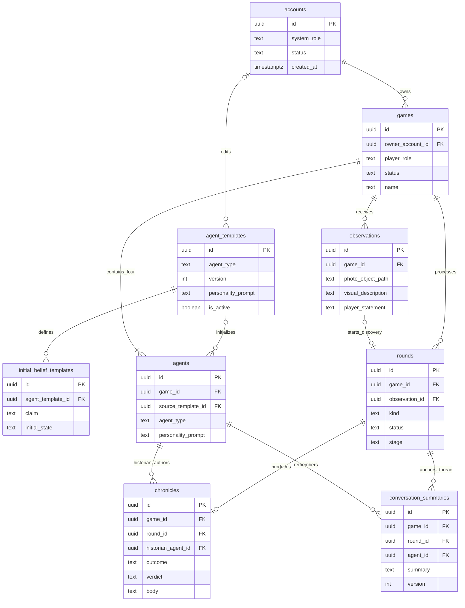
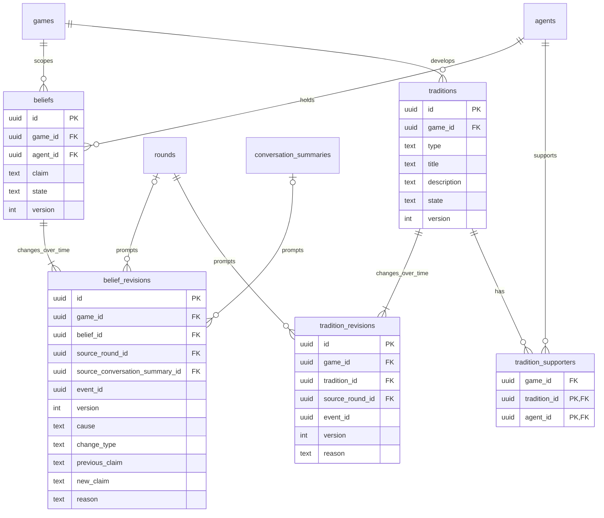
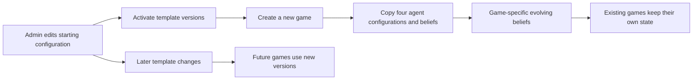
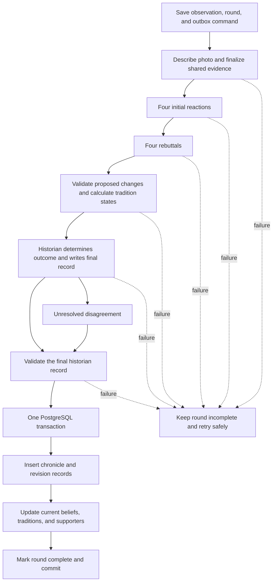

# Mythborn: Database Design

Status: **design for implementation; no schema or migrations have been implemented.** This document records the database decisions made with the project creator and proposes the fields and constraints needed to implement them. It complements [FUNCTIONAL_SPEC.md](./FUNCTIONAL_SPEC.md), [TECHNOLOGIES.md](./TECHNOLOGIES.md), and [ARCHITECTURE.md](./ARCHITECTURE.md).

## 1. Decisions and terminology

| Area | Agreed behavior |
| --- | --- |
| Accounts and games | An account can own multiple games. Each game has exactly one player role, selected at creation and permanently fixed. |
| Game roles | `observer`, `god`, and `messenger`. These are values on the game, rather than three separate role tables. |
| Administration | An account-level `admin` permission grants access to all application operations. It is separate from a game's player role. |
| Agents | Each game has a priest, scientist, soldier, and historian, each with its own evolving beliefs. |
| Starting beliefs | Administrators define starting beliefs through the admin portal. Game creation copies them into that game's agents. Later template edits affect new games only. |
| Discovery round | One photo discovery, all four initial reactions, one rebuttal per agent, and the historian's final record. A reaction or rebuttal is a phase, not a separate round record. |
| Verdict | The historian determines the leading interpretation and whether there is consensus, a majority, or unresolved disagreement. No player approval is required. |
| Disagreement | A tie or lack of agreement is recorded and the round completes. Further debate is not required. |
| Debate storage | Individual reactions and rebuttals are not permanent game records. |
| Permanent history | Keep the historian's verdict, essential metadata, observations, belief revisions, and shared traditions. |
| Messenger conversations | Direct conversations remain available. Keep short summaries, rather than full message transcripts. |

The **`games`** table stores what the product calls a civilization or world. The **`rounds`** table stores discovery episodes and the existing specification's council/closing operations. A council is still displayed as a council note, not a photo discovery. Existing `/worlds` and `/episodes` API names can map to these tables without creating duplicate tables.

The following schema layout, template versioning, summary update strategy, and indexes are implementation proposals based on these decisions. They are not additional product requirements approved during the discussion.

## 2. Storage boundaries

| Storage | Contents |
| --- | --- |
| Tiger Data PostgreSQL | Accounts' application permissions, games, agent configuration, observations, round status, chronicles, beliefs and revisions, traditions and revisions, conversation summaries, retrieval index, and operational jobs. |
| Supabase Auth | Passwords, social identities, and authentication sessions. |
| Supabase Storage | Private photo objects. PostgreSQL stores object paths, not image bytes or expiring signed URLs. |
| Temporal | Temporary, durable execution state needed to finish a round or conversation after a worker interruption. |

Use UUID primary keys and UTC `timestamptz` timestamps. Keep queryable fields as typed columns. Small, bounded `jsonb` values are appropriate for technical metadata; arbitrary model output and entire transcripts are not.

## 3. Relationship diagrams

### Accounts, configuration, and game history

The observation relationship is optional on both sides while uploads are being prepared; a committed discovery round must have exactly one observation. Councils and closing rounds have none. The game-creation transaction, rather than ER cardinality alone, ensures exactly four founding agents.

### Beliefs and shared traditions

These diagrams show the domain relationships. Foreign keys and uniqueness rules below also prevent cross-game references. Retrieval and operational tables are described separately to keep the diagrams readable.

## 4. Accounts and game roles

### `accounts`

One small application account record per authenticated user.

| Field | Purpose |
| --- | --- |
| `id` | UUID matching the verified Supabase Auth user ID. |
| `system_role` | `user` or `admin`; defaults to `user`. |
| `status` | `active` or `deleting`; blocks new actions during account cleanup. |
| `created_at`, `updated_at` | Account lifecycle metadata. |

Supabase Auth is external to Tiger Data, so there is no SQL foreign key into Supabase's Auth database. Do not copy passwords or provider tokens into this table. Account provisioning must never accept `system_role` from a public signup request. Bootstrap the first administrator through a controlled server-side operation; subsequent role changes require administrator permission.

An administrator can manage accounts, templates, and any game through the admin portal. Application authorization grants this access server-side, including private photo access. Admin access does not mutate a game's fixed player role or cause its agents to treat an Observer as a Messenger. Administrative operations must preserve data consistency and archived-game rules unless invoking an explicitly implemented administrative operation.

### `games`

| Field | Purpose |
| --- | --- |
| `id`, `owner_account_id` | Game identity and account FK. |
| `name` | Player-visible civilization name. |
| `player_role` | `observer`, `god`, or `messenger`; immutable after insert. |
| `status` | `starting`, `active`, `ending_requested`, `ending`, `archived`, or `deleting`. |
| `review_photo_description` | Boolean, initially false. |
| `last_council_at` | Last completed council time; nullable. |
| `created_at`, `updated_at`, `archived_at` | Lifecycle metadata; archive time is nullable. |

One account can own many games. Store the role directly on each game: separate Observer/God/Messenger tables or a role membership join table are unnecessary for a single owner with one fixed role. Enforce immutability with a database update trigger as well as API validation.

## 5. Admin-defined starting beliefs

### `agent_templates`

Global, versioned starting configuration for each of the four agent types.

| Field | Purpose |
| --- | --- |
| `id`, `agent_type` | Template identity and `priest`, `scientist`, `soldier`, or `historian`. |
| `version` | Positive integer, unique within the agent type. |
| `display_name`, `personality_prompt` | Starting identity and instructions. |
| `is_active` | Whether new games use this version. At most one active version per agent type. |
| `updated_by_account_id` | Nullable FK recording the administrator who last edited/activated it. |
| `created_at`, `updated_at` | Maintenance timestamps. |

### `initial_belief_templates`

| Field | Purpose |
| --- | --- |
| `id`, `agent_template_id` | Belief template identity and parent template FK. |
| `claim` | Admin-authored starting belief. |
| `initial_state` | One of `forming`, `held`, `questioned`, or `abandoned`. |
| `sort_order` | Stable ordering in the admin portal and initial agent context. |
| `created_at`, `updated_at` | Maintenance timestamps. |

Treat a template version used by a game as immutable. An admin edits a new version and activates it for future games. Keep the old version for provenance. The copied game state is authoritative even if template retention changes later.

### `agents`

| Field | Purpose |
| --- | --- |
| `id`, `game_id` | Persistent agent identity and game FK. |
| `agent_type` | One of the four founding types. |
| `display_name`, `personality_prompt` | Snapshot copied at game creation. |
| `source_template_id` | Nullable template FK; historical provenance, not a live configuration dependency. |
| `created_at` | Creation timestamp. |

Creating a game is one transaction: select the four active templates from a consistent snapshot, create the game and four agents, copy each initial belief into `beliefs`, write its first `belief_revisions` entry, and insert the start command into the outbox. Fail creation if any required template is missing. Agents load their copied configuration and current beliefs, never the latest global template. Starting beliefs are character assumptions, not claims that a real photo has already been observed.

## 6. Observations, rounds, and chronicles

### `observations`

| Field | Purpose |
| --- | --- |
| `id`, `game_id` | Observation identity and game FK. |
| `photo_object_path` | Private storage object key. |
| `source_image_sha256` | Hash of original submitted bytes for exact duplicate detection within a game. Not unique: deliberate reuse is allowed. |
| `mime_type`, `byte_size` | Normalized stored image's type and size. |
| `visual_description` | Neutral model-produced evidence; nullable until description succeeds. |
| `player_correction` | Optional correction, separate from the original description. |
| `player_statement` | Optional God proclamation or Messenger testimony; null for Observer. |
| `description_status` | `pending`, `awaiting_review`, `uncertain`, or `accepted`. |
| `created_at`, `accepted_at` | Upload and evidence-finalization timestamps. |

The description pipeline finalizes evidence before debate begins. Once accepted, the photo reference and evidence are immutable. All agents receive the same description and separately attributed correction/statement. Server validation uses the game's role; a SQL trigger can enforce the cross-table Observer restriction. Store neither GPS metadata nor image bytes in PostgreSQL.

### `rounds`

| Field | Purpose |
| --- | --- |
| `id`, `game_id`, `sequence_number` | Operation identity and ordering within the game. |
| `kind` | `discovery`, `council`, or `closing`. |
| `observation_id` | Required, unique observation FK for discovery; null for council/closing. |
| `status` | `queued`, `running`, `needs_attention`, `complete`, `failed`, or `abandoned`. |
| `stage` | `queued`, `describing`, `awaiting_review`, `awaiting_clarity_choice`, `reacting`, `debating`, `writing`, or `complete`. Failures retain the last applicable stage. |
| `idempotency_key` | Client/operation key, unique within a game. |
| `error_code` | Nullable, sanitized failure code. |
| `started_at`, `completed_at`, `created_at`, `updated_at` | Processing timestamps. |

`sequence_number` orders history operations, including councils and the closing record; it is not a count of debate phases. Retrying a failed or interrupted round reuses the same ID and retains its safe checkpoint. Retrying failed work must reacquire the processing slot while the game is eligible. If beliefs/traditions have changed since its model calls, regenerate affected phases from current state rather than committing stale proposals. A failed/abandoned round has no chronicle and changes no beliefs or traditions. A `needs_attention` round still occupies the game processing slot until retried or explicitly failed/abandoned.

`status` describes the operation's lifecycle; `stage` describes how far it has progressed. The architecture's review/clarity states map to `status = running` with `stage = awaiting_review` or `awaiting_clarity_choice`. The corresponding observation has `description_status = awaiting_review` or `uncertain`. On successful completion, both round status and stage are `complete`. On `needs_attention`, `failed`, or `abandoned`, retain the previous stage for recovery rather than treating the failure status as a processing stage. A council starts at `reacting`; a closing round starts at `writing`; neither describes a new photo.

### `chronicles`

One final historian record per completed round. Council and closing records share this table instead of requiring separate tables with nearly identical fields.

| Field | Purpose |
| --- | --- |
| `id`, `game_id`, `round_id` | Chronicle identity, game FK, and unique round FK. |
| `historian_agent_id` | FK to that game's historian. |
| `title` | Short history-entry title. |
| `outcome` | `consensus`, `majority`, or `unresolved` for discovery/council; null for a closing record. |
| `verdict` | Concise historian conclusion, including a clear statement when disagreement remains unresolved. |
| `body` | Saved account explaining the evidence, important dissent, and resulting changes. |
| `suggestion` | Optional next outdoor discovery, allowed only for discovery records. |
| `metadata` | Small `jsonb` object limited to generation details such as model ID and prompt version. |
| `created_at` | Final record timestamp. |

Round kind and observation are available through foreign keys; do not duplicate the photo description, debate, or complete belief ledger in metadata. Changes are available through revision tables. The historian determines the interpretive outcome from the temporary debate; there is no interpretation-vote table, approval status, or permanent draft history. Validate the structured historian response, but do not require another debate to resolve a tie.

The existing three-of-four rule for **tradition adoption** remains a separate deterministic rule. It does not force the historian to declare a majority interpretation. Support declarations are temporary inputs; retain the resulting supporter set and tradition revisions.

## 7. Agent beliefs and their history

### `beliefs`

Current state for one belief held by one agent.

| Field | Purpose |
| --- | --- |
| `id`, `game_id`, `agent_id` | Belief identity and owning agent/game FKs. |
| `claim` | Current wording of the belief. |
| `state` | `forming`, `held`, `questioned`, or `abandoned`. |
| `version` | Positive integer matching the latest committed revision. |
| `created_at`, `updated_at` | First appearance and latest change. |

Keep the same belief ID when its wording or state changes. A genuinely new belief gets a new ID. Retain abandoned beliefs with their history instead of physically deleting them during gameplay.

### `belief_revisions`

Append-only history; write a revision only when a belief actually changes.

| Field | Purpose |
| --- | --- |
| `id`, `game_id`, `belief_id`, `version` | Revision identity and ordered parent history. |
| `event_id` | Stable operation UUID for retry deduplication. |
| `cause` | `initial`, `discovery`, `council`, or `messenger`. |
| `change_type` | `formed`, `strengthened`, `weakened`, `revised`, or `abandoned`. |
| `previous_claim`, `previous_state` | Before values; null for the first revision. |
| `new_claim`, `new_state` | After values. |
| `reason` | Brief, self-contained explanation of the change. |
| `source_round_id` | Discovery/council FK, otherwise null. |
| `source_conversation_summary_id` | Messenger summary FK, otherwise null. |
| `created_at` | Change timestamp. |

For `initial`, both source fields are null. For `discovery`/`council`, only the round source is present and its kind must match. For `messenger`, only the conversation source is present. Source records must belong to the same game. The reason captures the relevant testimony so the revision remains understandable when the rolling conversation summary is updated.

The first revision preserves the copied starting claim and state. Do not create a revision for every round if the agent keeps the same belief. No numeric confidence scores are introduced.

## 8. Shared myths, rituals, and taboos

### `traditions`

One shared table, separate from agent beliefs and chronicles. A `type` column distinguishes myths, rituals, and taboos.

| Field | Purpose |
| --- | --- |
| `id`, `game_id` | Tradition identity and game FK. |
| `type` | `myth`, `ritual`, or `taboo`. |
| `title`, `description` | Current shared idea. |
| `state` | `adopted`, `contested`, or `retired`. |
| `version` | Latest committed revision number. |
| `created_at`, `updated_at` | Origin and latest change. |

### `tradition_supporters`

A small relationship table with `game_id`, `tradition_id`, and `agent_id`. Its primary key is `(tradition_id, agent_id)`. Each tradition has at most four current supporter rows. Foreign keys ensure supporters belong to the same game. This stores current support, not every statement or individual vote during debate.

### `tradition_revisions`

| Field | Purpose |
| --- | --- |
| `id`, `game_id`, `tradition_id`, `version` | Revision identity and ordered history. |
| `event_id`, `source_round_id` | Stable change event and discovery/council source FK. |
| `previous_title`, `previous_description`, `previous_state` | Before values; null for creation. |
| `new_title`, `new_description`, `new_state` | After values. |
| `previous_supporter_ids`, `new_supporter_ids` | Bounded UUID-array snapshots, each with at most four distinct agents from this game. |
| `reason`, `created_at` | Brief explanation and timestamp. |

The worker calculates state using the existing functional-spec rule: at least three supporters means adopted; a new idea with one or two supporters is contested; an adopted tradition dropping to two is contested; an existing tradition dropping to zero or one is retired. A new idea with zero support creates no tradition row. Record changes to support or wording even when the state stays the same. Unrelated traditions remain untouched.

Current support uses proper foreign keys in the join table. Historical arrays are compact snapshots, validated by the write path/database trigger; arrays do not provide individual SQL foreign keys. Keep retired traditions and their revisions until game deletion.

## 9. Messenger conversation summaries

### `conversation_summaries`

One rolling summary per discovery-round/agent pair. This gives an agent continuity without accumulating messages or historical summary versions.

| Field | Purpose |
| --- | --- |
| `id`, `game_id`, `round_id`, `agent_id` | Thread identity, originating discovery, and recipient agent FKs. |
| `summary` | Short account of testimony, questions, answers, and unresolved points useful later. |
| `version` | Positive integer used to reject stale concurrent updates. |
| `last_event_id` | Most recent successfully applied exchange UUID. |
| `created_at`, `updated_at` | Thread timestamps. |

The player can still converse directly with an agent. Each exchange uses the current summary and current beliefs, generates a reply, and updates the summary. Keep summaries bounded with a configurable length limit; replace the previous summary instead of appending indefinitely. The live browser can display the current exchange, but reopening a thread restores a summary rather than its exact transcript.

The asynchronous POST returns `202` and a command ID. The browser polls the ownership-checked `GET /commands/{id}` endpoint to receive the reply. Use a bounded, expiring `result_payload` on the existing outbox row for temporary reply delivery, not a message table. The expiry cleanup removes the reply; later reads return processing status and the saved summary. The exact expiry period is an implementation setting. This temporary delivery buffer is separate from permanent conversation history.

Commit the updated summary, any belief revision/current-state changes, the expiring reply buffer, and the processed operation marker together. Route exchanges through the game coordinator so a recipient reads and updates beliefs outside an active discovery/council; serialize exchanges within a thread and check the expected summary version. A final-commit row lock alone cannot protect a model call that read stale beliefs. Duplicate old events must be rejected through the operation marker/version checks, not just `last_event_id`, which remembers only the latest event. Shared culture changes wait for a discovery or council.

Only Messenger games allow this gameplay endpoint. The target must be an agent in the same game, the originating discovery must be complete, and the game must be active. Administrative access does not fabricate a different gameplay role.

## 10. Retrieval and operational tables

These tables support the previously selected architecture rather than adding game content.

| Table | Essential fields and rules |
| --- | --- |
| `search_documents` | `id`, `game_id`, optional `agent_id` visibility scope, exactly one of `observation_id`, `chronicle_id`, `belief_id`, or `conversation_summary_id`, a bounded `content` excerpt, embedding, source version, and timestamps. Each source reference is a real FK; allow at most one search row per source. The index is derived and rebuildable. |
| `workflow_outbox` | `id` as command/event UUID, `account_id`, optional `game_id`/`round_id`, command type, idempotency key, bounded pending payload, nullable bounded `result_payload` and `result_expires_at` for temporary reply delivery, status, attempt count, lease/retry timestamps, delivered/processed timestamps, and sanitized error code. Unique `(account_id, command_type, idempotency_key)`. Delivery and successful processing are distinct. |
| `account_deletion_jobs` | `id`, external account UUID, status, cleanup stage, timestamps, and sanitized error code. One unfinished job per account. Keep the job independent of the application-account FK so it survives removal of the account row until external Auth cleanup succeeds. |

Use the embedding dimension already selected in `TECHNOLOGIES.md` (768) for the retrieval index. Index committed observations, chronicles including council notes, current beliefs, and relevant conversation summaries. Do not index raw reactions, rebuttals, or messages. Shared records have no agent visibility scope; private beliefs and summaries are visible to their owning/recipient agent. All retrieval is restricted to the current game, even for an administrator running gameplay.

An outbox may temporarily contain a Messenger input so a crash does not lose accepted work. Clear its raw input once processing succeeds. Keep only the bounded reply delivery buffer until `result_expires_at`, then clear it, leaving small identity/status fields for retry deduplication. Expiring a reply does not remove the operation marker. Mark delivery only after Temporal accepts the command; mark processing only when the corresponding state change commits. For discovery/council/closing operations, this processed marker shares the final-record transaction. Do not prune markers while workflows can still replay the events. Expiry of older markers also defines the supported HTTP idempotency window; it must be documented during implementation.

## 11. Constraints and indexes

Use these rules in the SQL migrations, rather than relying only on model output or UI controls:

- Check allowed enum-like values, positive versions, and valid nullability combinations.
- Add `UNIQUE (game_id, id)` to game-owned parent tables and use composite FKs such as `(game_id, agent_id)` referencing `agents(game_id, id)`. Apply the same pattern to observations, rounds, beliefs, traditions, summaries, and chronicles to prevent cross-game relationships.
- Enforce `UNIQUE (game_id, agent_type)` and create all four founding agents together.
- Enforce `UNIQUE (agent_type, version)` on templates and a partial unique index on `agent_type WHERE is_active`.
- Enforce `UNIQUE (game_id, sequence_number)`, `UNIQUE (game_id, idempotency_key)`, and a unique non-null `observation_id` on rounds.
- A discovery round must reference an observation; council/closing rounds must not. Use a row check for this shape and triggers for cross-table kind/state checks.
- A partial unique index on `rounds(game_id)` for statuses `queued`, `running`, and `needs_attention` permits only one open history operation per game. The coordinator gives discovery work priority over scheduled councils.
- A partial unique index on `rounds(game_id) WHERE kind = 'closing'` ensures one closing operation; retries reuse it.
- Enforce `UNIQUE (round_id)` on chronicles. A deferred constraint trigger validates that a completed round has a chronicle and a chronicle's round is complete at transaction end.
- Validate the chronicle author is this game's historian. Only closing records can have a null outcome; only discovery records can have a suggestion.
- Enforce `UNIQUE (belief_id, version)` and `UNIQUE (belief_id, event_id)` on belief revisions, with the corresponding constraints for traditions. Consolidate changes to the same item within one operation into one revision.
- Enforce `UNIQUE (round_id, agent_id)` on conversation summaries and validate that their source is a completed discovery in a Messenger game.
- Update current belief/tradition versions and their new revision in the same transaction. Validate current support and resulting tradition state together.

Useful read indexes:

| Query | Index |
| --- | --- |
| Account's game list | `games(owner_account_id, status, created_at DESC)` |
| Game history/progress | `rounds(game_id, sequence_number DESC)` and `chronicles(game_id, created_at DESC)` |
| Previously submitted image | `observations(game_id, source_image_sha256)` |
| Agent's current beliefs | `beliefs(game_id, agent_id, state)` |
| Belief/tradition history | Parent ID plus descending version; uniqueness indexes can serve these reads. |
| Shared culture | `traditions(game_id, state, type)` |
| Agent conversation memory | `conversation_summaries(game_id, agent_id, updated_at DESC)` |
| Pending commands | Partial index on retry/lease timestamps for pending, retryable, or dispatched-unprocessed outbox rows. |
| Memory search | Game/visibility scope plus keyword/vector indexes appropriate to the existing Tiger Data retrieval plan. |

Index child FK columns used in parent deletion and joins. Avoid blanket JSON indexes or partitioning before actual data volume justifies them. This schema is ordinary relational application data; time-series hypertables are not required for the first version.

## 12. Round completion and failure recovery

The historian receives the evidence, all reactions/rebuttals, and the already computed cultural proposal, so the chronicle describes the changes that will actually be committed. Interpretation outcomes are determined by the historian; tradition states are computed by the worker before generation.

During processing, persist only stage/status in the game database. Completed model activities can return bounded results into Temporal's durable execution history so a worker interruption does not require starting the debate over. Transient results feed the next phase and are not inserted into a permanent `agent_contributions` table. Live reaction previews, if offered, are best-effort; reloading restores durable stage and final history, not a saved raw debate.

Temporal still stores activity inputs/results for execution recovery. Omitting game tables does not mean those payloads never exist in storage. Bound output sizes, keep only necessary content, configure closed-history retention, and use Continue-As-New without carrying old transcripts forward. Avoid logging raw debates and chats. Deleting game rows alone does not immediately erase retained workflow history; include workflow-retention cleanup in the deletion implementation.

For final completion, lock the game and affected current records, verify the round remains eligible, then commit the chronicle, belief revisions, tradition revisions/supporter updates, optional suggestion, completion status, and processed outbox marker together. A retry that finds the existing committed chronicle returns success without inserting revisions again. No partially updated society is visible if the transaction fails.

Apply the same atomicity to council notes and their changes. A closing round inserts its final chronicle and marks the game archived in one transaction. Messenger operations serialize with other game-state mutations so a conversation cannot overwrite changes made during a discovery/council. Different games remain independent.

## 13. Deletion and storage growth

Deleting a game first marks it `deleting` and blocks new actions. Stop its workflows, clear pending commands and transient reply buffers, delete private photo objects, then remove relational records and derived search rows. Keep the deletion command/tombstone until external cleanup succeeds and handle retained workflow history according to its configured retention policy. Foreign-key cascades remove game-owned rows; use an explicit transaction/deletion plan for historical cross-references so cascades remain consistent. Template records and other games survive. An account deletion job coordinates all games, removal of the application account, and final Supabase Auth deletion; its independent external account UUID keeps cleanup retryable after the application account is gone.

Published template records should be retired rather than normally deleted. If template removal is implemented, copied agent prompts and initial belief revisions must survive; clear nullable provenance references instead of deleting the game's state. Administrative editor references can use `ON DELETE SET NULL` when an admin account is removed.

Permanent growth is proportional to completed rounds, beliefs/traditions that actually change, and discovery-agent threads that are actually used. Every discovery creates one observation, one round, one chronicle, and only the necessary revisions. Each conversation thread keeps one bounded summary. A traditional debate would add eight reaction/rebuttal records per discovery; this design avoids those records entirely.

Do not silently truncate belief or tradition history: retaining revisions is an explicit decision. Reduce growth through bounded summaries/metadata, change-only revisions, derived search excerpts, and cleanup of finished operational payloads. Photo objects will also consume storage independently of the number of SQL rows.

## 14. Implementation order

1. Add migrations for accounts, templates, games, agents, and initial/current beliefs with their revisions.
2. Add observations, rounds, chronicles, traditions, supporters, and tradition revisions; enforce atomic finalization and role immutability.
3. Add outbox dispatch/recovery and deletion jobs using stable event IDs.
4. Add Messenger summaries and serialized summary/belief updates.
5. Add the derived memory-search index and admin portal operations using the same authorization and consistency rules.

The design deliberately avoids generic permission matrices, separate tables for each player role, chronicle approval queues, full chat histories, permanent debate records, and a separate suggestions table. New requirements can extend the schema later without changing the decisions recorded here.
